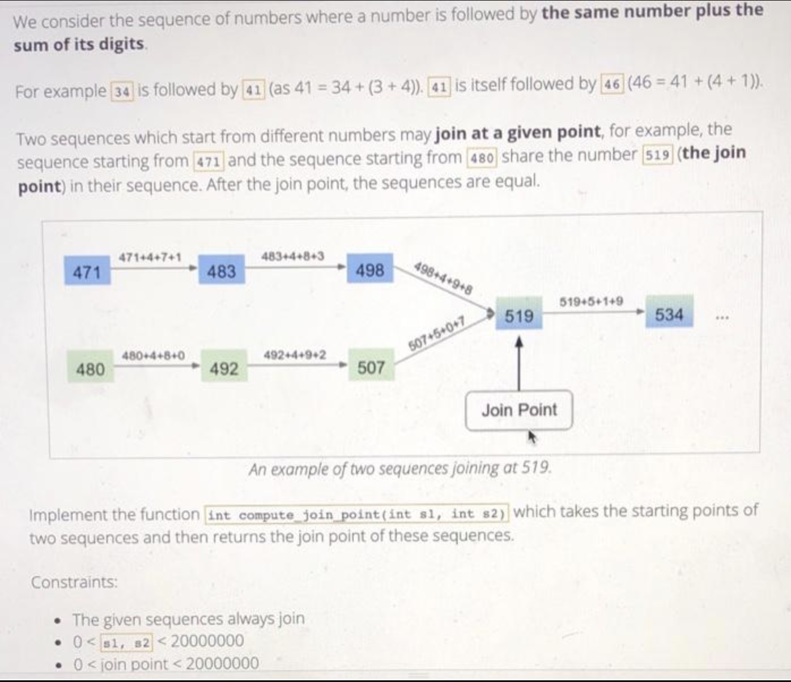
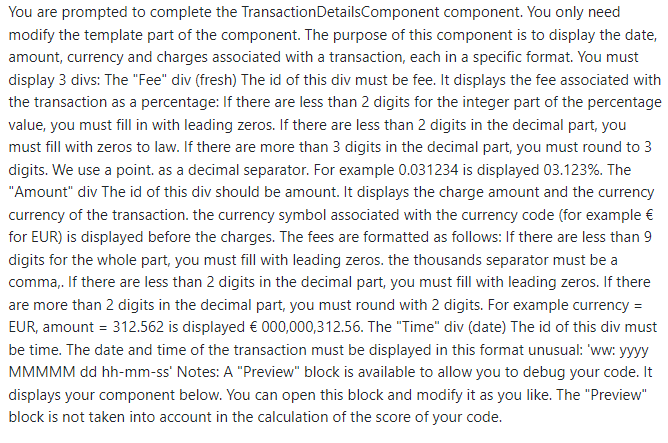

# Résolution problèmes tests techniques

### I. Trouver la Paire idéale

<u>Problème :</u>
```
On souhaite retourne une paire de nombres (numbers) dans un tableau dont la somme est donnée(sum)
Contraintes :

1- Si on trouve une seule paire dans la liste de nombre, on retourne cette seule paire trouvée
2- Si on retrouve 2 paires ou plus, on retourne celle qui a l'indice de gauche la plus petite
3- Si on retrouve 2 paires ou plus avec les même indice de gauche, on retourne celle qui à l'indice de droite la plus petite.
4- Si on retrouve rien, on retourne [0,0]
```

<u>Résolution :</u>

```java
public int[] findSumPair(int[] numbers, int sum) {
      int[] pair = new int[]{0,0};

      outlerloop:
      for (int i = 0; i < numbers.length; i++) {
          for (int j = i + 1; j < numbers.length; j++) {
              if (numbers[i] + numbers[j] == sum) {
                  pair = new int[]{i,j};
                  break outlerloop;
              }
          }
      }

      return pair;
}
```

<br/>

### II. Trouver le duo digit

<u>Problème :</u>
```
Je veux implémenter une fonction pour vérifier si un nombre donné contient plus de deux chiffres différents, 
que l'on appelle des duodigits :
1- 12 , 110 , -33333 : sont tous des duodigits , puisqu'ils n'ont pas plus de deux chiffres différents 
2- 102 : n'est pas un duodigit puisque ses chiffres ; 1 et 0 et 2 sont trois chiffres différents
```

<u>Résolution :</u>

```java
public boolean isDuoDigit(long number) {
  String numberString = String.valueOf(Math.abs(number));
  return (int) numberString.chars().distinct().count() <= 2;
}
```

<br/>

### III. Calcul de currencys Version 1

<u>Problème :</u>

```
Considérons les billets et pièces de valeurs suivantes : 20 euros, 10 euros, 5 euros, 2 euros, 1 euros. 

Écrivez une fonction rendrecurrency qui prend en paramètres un entier prix et cinq valeurs entières x20, x10, x5, x2, x1 représentant le nombre de billets et de pièces de chaque sorte que donne un client pour payer l’objet dont le prix est mentionné. 

La fonction doit renvoyer cinq valeurs représentant la somme qu’il faut rendre au client, décomposée en billets et pièces (dans le même ordre que précédemment). 

La décomposition doit être faite en rendant le plus possible de billets et pièces de grosses valeurs (éventuellement avec d'autres billets que ceux apportés par le client; on suppose qu'il y a toujours assez de billets chez le vendeur).


Pour renvoyer les cinq valeurs, vous utilisez l'instruction:
return "res20, res10, res5, res2, res1"
où les cinq variables res20 à res1 contiennent les cinq valeurs à renvoyer (res20 contient le nombre de billets de 20 à remettre, ..., res1 le nombre de pièces de 1 à remettre).

S'il manque de l'argent, la fonction renverra cinq valeurs "Null"
```

<u>Résolution :</u>

```java
public String makeChange(int prix, int x20, int x10, int x5, int x2, int x1) {
    int amountPaid = (x20 * 20) + (x10 * 10) + (x5 * 5) + (x2 * 2) + x1;
    int amountReturned = amountPaid - prix;

    if (amountReturned < 0) {
        return "null";
    }

    int currency20 = amountReturned / 20;
    amountReturned %= 20;

    int currency10 = amountReturned / 10;
    amountReturned %= 10;

    int currency5 = amountReturned / 5;
    amountReturned %= 5;

    int currency2 = amountReturned / 2;
    amountReturned %= 2;

    int currency1 = amountReturned;

    return currency20 + ", " + currency10 + ", " + currency5 + ", " + currency2 + ", " + currency1;
}
```

<br/>

### III. Calcul de currencys Version 2

<u>Problème :</u>

```
En s'appuyant sur la V1, On écrit une autre fonction qui prend en paramètre uniquement un prix et retourne le nombre de monnaie possible res20, res10, res5, res2 et res1
```

<u>Résolution :</u>

```java
public String makeChange(int prix) {
    int currency20 = prix / 20;
    int leftCurrency = prix % 20;

    int currency10 = leftCurrency / 10;
    leftCurrency %= 10;

    int currency5 = leftCurrency / 5;
    leftCurrency %= 5;

    int currency2 = leftCurrency / 2;
    leftCurrency %= 2;

    int currency1 = leftCurrency;

    return new StringBuilder().append(currency20).append(", ")
            .append(currency10).append(", ")
            .append(currency5).append(", ")
            .append(currency2).append(", ")
            .append(currency1).toString();
}
```

<br/>

### IV. Entier plus proche de zéro

<u>Problème :</u>

```
J'ai un tableau d'entiers et je dois trouver celui qui est le plus proche de zéro les entiers positifs sont prioritaire sur les négatifs.
```

<u>Résolution :</u>

```java
public int findClosestToZero(int[] numbers) {
    if (numbers.length == 0) {
        throw new IllegalArgumentException("Le tableau ne doit pas être vide.");
    }

    int closest = numbers[0];

    for (int i = 1; i < numbers.length; i++) {
        int current = numbers[i];

        if (Math.abs(current) < Math.abs(closest) || (Math.abs(current) == Math.abs(closest) && current > 0)) {
            closest = current;
        }
    }

    return closest;
}
```

<br/>

### V. Trouver le plus petit intervalle

<u>Problème :</u>

```
Implémenter la méthode findSmallestInterval(numbers) qui retourne le plus petit intervalle positif entre 2 éléments du tableau numbers(numbers est en fait un array de type int).
Par exemple: si je considère le tableau [1 6 4 8 2],le plus petit
intervalle est 1(différence entre 2 et 1).

Les contraintes:
1- Numbers contient au moins 2 éléments et au maximum 100000 éléments.
2- La solution qui privilégie la vitesse d'execution pour les tableaux
de grande taille obtiendra le plus de points.
3- La différence entre 2 éléments ne dépassera jamais la capacité d'un entier pour votre langage.
```

<u>Résolution :</u>

```java
import java.util.Arrays;

public int findSmallestInterval(int[] numbers) {
    if (numbers.length < 2 || numbers.length > 100000) {
        throw new IllegalArgumentException("Le tableau doit contenir entre 2 et 100000 éléments.");
    }

    Arrays.sort(numbers);
    int smallestInterval = Integer.MAX_VALUE;

    for (int i = 0; i < numbers.length - 1; i++) {
        int currentInterval = numbers[i + 1] - numbers[i];

        if (currentInterval < smallestInterval && currentInterval > 0) {
            smallestInterval = currentInterval;
        }
    }

    return smallestInterval;
}
```
<br/>

### VI. Compter les caractères pour un mot

<u>Problème :</u>

```
On vous donne un tableau de chaînes de caractères words et une chaîne de caractères chars.

Une chaîne est bonne si elle peut être formée par les caractères de chars (chaque caractère ne peut être utilisé qu'une seule fois).

Retournez la somme des longueurs de toutes les bonnes chaînes de caractères en mots.

Exemple 1 :

Entrée : words = ["cat", "bt", "hat", "tree"], chars = "atach"
Sortie : 6
Explication : Les chaînes qui peuvent être formées sont "cat" et "hat", la réponse est donc 3 + 3 = 6.

Exemple 2 :

Entrée : words = ["hello", "world", "leetcode"], chars = "welldonehoneyr"
Résultat : 10
Explication : Les chaînes qui peuvent être formées sont "hello" et "world", la réponse est donc 5 + 5 = 10.

Contraintes :

. 1 <= words.length <= 1000
. 1 <= words[i].length, chars.length <= 100
. les mots[i] et les caractères sont des lettres minuscules anglaises.
```

<u>Résolution :</u>

```java
import java.util.Arrays;
import java.util.Comparator;
import java.util.HashMap;
import java.util.Map;

public static int countCharacters(String[] words, String chars) {
    validateInput(words, chars);

    Map<Character, Integer> charCountMap = getCharCount(chars);

    int totalLength = 0;
    for (String word : words) {
        Map<Character, Integer> wordCount = new HashMap<>(charCountMap);
        if (isValidWorld(word, wordCount)) {
            totalLength += word.length();
        }
    }

    return totalLength;
}

private Map<Character, Integer> getCharCount(String chars) {
    Map<Character, Integer> charCountMap = new HashMap<>();
    for (char c : chars.toCharArray()) {
        charCountMap.put(c, charCountMap.getOrDefault(c, 0) + 1);
    }
    return charCountMap;
}


private boolean isValidWorld(String word, Map<Character, Integer> wordCount) {
    for (char c : word.toCharArray()) {
        if (wordCount.containsKey(c) && wordCount.get(c) > 0) {
            wordCount.put(c, wordCount.get(c) - 1);
        } else {
            return false;
        }
    }

    return true;
}

private void validateInput(String[] words, String chars) {
    if (words.length < 1 || words.length > 1000) {
        throw new IllegalArgumentException("Contrainte : 1 <= words.length <= 1000");
    }

    if (chars.length() > 100) {
        throw new IllegalArgumentException("Contrainte : chars.length <= 100");
    }

    String smallString = Arrays.stream(words).min(Comparator.comparing(String::length)).get();
    if (smallString.length() < 1) {
        throw new IllegalArgumentException("Contrainte : 1 <= words[i].length");
    }
}
```
<br/>

### VII. Trouver le noeud suivant :

<u>Problème 1er cas recherche à partir d'un noeud :</u>

```
Trouver le nœud suivant au même niveau que le nœud donné dans un arbre binaire

Étant donné un arbre binaire et un nœud dedans, écrivez un algorithme efficace pour trouver son prochain nœud au même niveau que le nœud.

Par exemple, considérons l'arbre binaire suivant :

              1
            /  \
           /    \
          2      3
         / \      \
        4   5      6
                  / \
                 7   8
    
```

<u>Résolution :</u>

```java
public class Node {
    private Node left = null;
    private Node right = null;
    private int value;

    public Node(int value) {
        this.value = value;
    }

    public static Node findRightNode(Node root, Node node){
        if (root == null) {
            return null;
        }

        Queue<Node> queue = new ArrayDeque<>();
        queue.add(root);
        Node currentNode;

        while(!queue.isEmpty()) {
            int queueSize = queue.size();
            while (queueSize-- > 0)
            {
                currentNode = queue.poll();

                if (currentNode == node)
                {
                    if (queueSize == 0) {
                        return null;
                    }
                    return queue.peek();
                }

                if (currentNode.left != null) {
                    queue.add(currentNode.left);
                }

                if (currentNode.right != null) {
                    queue.add(currentNode.right);
                }
            }
        }

        return null;
    }

    public int getValue() {
        return value;
    }

    public Node getLeft() {
        return left;
    }

    public Node getRight() {
        return right;
    }

    public void setLeft(Node left) {
        this.left = left;
    }

    public void setRight(Node right) {
        this.right = right;
    }
}
```

<u>Problème 2ème cas recherche à partir d'une valeur :</u>

```
Notre arbre binaire est construite de sorte que depuis la root, les valeurs inférieures à la route se trouvent à gauche et les valeurs supérieures se trouvent à droite. Nous répétons cette opération sur chaque noeud.

Par exemple, considérons l'arbre binaire suivant :

              8
            /  \
           /    \
          5      10
         / \      \
        4   6      11
       /           / \
      3          10  12
    
```

<u>Résolution :</u>

```java
public Node searchNode (Node node, int searchValue) {
    if (node == null) {
        return null;
    }


    if (node.getValue() == searchValue) {
        return node;
    }

    if (node.getValue() < searchValue) {
        return searchNode(node.getRight(), searchValue);
    }

    if (node.getValue() > searchValue) {
        return searchNode(node.getLeft(), searchValue);
    }

    return null;
}
````

<u>Problème 3ème cas recherche à partir d'une valeur sans noeud précisé :</u>

```
Par exemple, considérons l'arbre binaire suivant :

              8
            /  \
           /    \
          5      10
         / \      \
        4   6      11
       /           / \
      3          10  12
    
```

<u>Résolution :</u>

```java
public Node find(int v) {
    Node current = this;

    while (current != null) {
        if (current.value == v) {
            return current;
        }
        current = v < current.value ? current.left : current.right;
    }

    return null;
}

```

### VIII. Trouver les trois actions dont le coût moyen est le plus élévé

<u>Problème :</u>

```
Dans ce problème, on vous donne les prix quotidiens de certaines actions et on vous demande de trouver les trois actions dont le coût moyen est le plus élevé.

Implémentez la méthode getTopStocks(stocks, prices) qui prend comme entrée:

1- un tableau de chaînes de caractères (stocks), représentant les actions considérées.

2- un tableau de 2 dimensions (prices), représentant les prix des actions (listes intérieures) pour chaque jour (liste extérieure).
    
```

<u>Résolution :</u>

```java
public List<String> getTopStocks(String[] stocks, int[][] prices) {
    Map<String, Double> stockAverages = getStockAverages(stocks, prices);
    List<Entry<String, Double>> sortedStocks = sortStockAverages(stockAverages);
    List<String> topStocks = retrieveTopStocks(sortedStocks);

    return topStocks;
}

private Map<String, Double> getStockAverages(String[] stocks, int[][] prices) {
    Map<String, Double> stockAverages = new HashMap<>();

    for (int i = 0; i < stocks.length; i++) {
        stockAverages.put(stocks[i], calculateAverage(prices[i]));
    }

    return stockAverages;
}

private double calculateAverage(int[] prices) {
    int sum = 0;
    for (int price : prices) {
        sum += price;
    }
    return (double) sum / prices.length;
}

private List<Entry<String, Double>> sortStockAverages(Map<String, Double> stockAverages) {
    List<Entry<String, Double>> sortedStocks = new ArrayList<>(stockAverages.entrySet());
    sort(sortedStocks, (a, b) -> b.getValue().compareTo(a.getValue()));
    return sortedStocks;
}

private List<String> retrieveTopStocks(List<Entry<String, Double>> sortedStocks) {
    List<String> topStocks = new ArrayList<>();

    for (int i = 0; i < Math.min(3, sortedStocks.size()); i++) {
        topStocks.add(sortedStocks.get(i).getKey());
    }

    return topStocks;
}

```

<br/>

### IX.  Identifier une chaîne de caractère correcte composée de parenthèse () et de crochets []

<u>Problème :</u>

```
Cet exercice consiste à identifier une chaîne de caractère correcte composée de parenthèse () et de crochets []. Une chaîne de ce type est considérée comme correcte:

1- si c'est une chaîne vide ou null
2- si la chaîne A est correcte, (A) et [A] sont correctes
3- si les chaînes A et B sont correcte, la concaténation AB est également correcte

La chaîne contient au plus 10000 caractères

Exemple: [()] est correcte, (()[]) est correcte, ([)] n'est pas correcte, (( n'est pas correcte.
```

<u>Résolution :</u>

```java
import java.util.Stack;

public boolean isCorrectString(String s) {
    if (s == null || s.isEmpty()) {
        return true;
    }

    Stack<Character> stack = new Stack<>();

    for (char c : s.toCharArray()) {
        if (c == '(' || c == '[') {
            stack.push(c);
        } else if (c == ')' || c == ']') {
            if (stack.isEmpty()) {
                return false;
            }

            char top = stack.pop();

            if ((c == ')' && top != '(') || (c == ']' && top != '[')) {
                return false;
            }
        }
    }

    return stack.isEmpty();
}
```

### X.  Calcul du prix total avec discount

<u>Problème :</u>

```
Vous travaillez pour un magasin qui souhaite offrir une réduction de "discount%" sur le produit le plus cher acheté par un client donné pendant la période des soldes.
Le responsable du magasin vous demande de développer la méthode calculateTotalPrice().

Cette méthode:

1- prend en paramètres la liste de prix des produits achetés par le client et le pourcentage de réduction "discount".

2-retourne le prix de vente total (arrondi à l'entier inférieur si le total ne tombe pas rond).

Contraintes:
-    0=<"discount"<=100
-    0=<prix d'un produit <100000
-    0<nombre de produits<100
```

<u>Résolution :</u>

```java
public int calculateTotalPrice(int[] prices, int discount) {
  if (discount < 0 || discount > 100) {
      throw new IllegalArgumentException("Discount percentage must be between 0 and 100");
  }

  int total = 0;
  for(int price : prices) {
      total= total + price;
  }

  int maxPrice = Arrays.stream(prices).max().getAsInt();

  return (int) (((total - maxPrice) + (float)(maxPrice -(maxPrice * discount/100d))));
}
```

<br/>

### XI.  Vérifier existence nombre dans une liste

<u>Problème :</u>

```
On donne un liste de valeurs vérifier l'existance de k dans la liste.
Si k existe retourner true.
```

<u>Résolution :</u>

```java
import java.util.Arrays;

boolean exists(int[] ints, int k) {
    if (ints.length == 0) {
        return false;
    }
    return Arrays.binarySearch(ints, k) >= 0;
}
```

<br/>

### XII.  Trouver l'entier n en convertissant l'entier n en une liste de chiffres

<u>Problème :</u>

```
Cette méthode commence par convertir l'entier n en une liste de chiffres. 

Ensuite, elle vérifie si tous les chiffres sont identiques en utilisant un ensemble pour éliminer les doublons. 

Si tous les chiffres sont identiques, la méthode retourne -1.

Si tous les chiffres ne sont pas identiques, la méthode entre dans une boucle où elle incrémente progressivement n d'une unité à chaque itération. 

À chaque itération, elle convertit le nouvel entier n en une liste de chiffres et vérifie si tous les chiffres sont différents en utilisant un ensemble. 

Si tous les chiffres sont différents, la méthode retourne cet entier n.

Notez que cette méthode fonctionne pour des entiers strictement positifs inférieurs à 2^31, comme spécifié dans la question.
```

<u>Résolution :</u>

```java
import java.util.HashSet;

public int next(int n) {
    char[] digits = String.valueOf(n).toCharArray();

    if (isAllDigitsSame(digits)) {
        return -1;
    }

    while (true) {
        n++;
        char[] newDigits = String.valueOf(n).toCharArray();
        if (areAllDigitsDifferent(digits, newDigits)) {
            return n;
        }
    }
}

private boolean isAllDigitsSame(char[] digits) {
    for (int i = 1; i < digits.length; i++) {
        if (digits[i] != digits[0]) {
            return false;
        }
    }
    return true;
}

private boolean areAllDigitsDifferent(char[] digits1, char[] digits2) {
    HashSet<Character> digitSet = new HashSet<>();

    for (char digit : digits1) {
        digitSet.add(digit);
    }

    for (char digit : digits2) {
        if (digitSet.contains(digit)) {
            return false;
        }
    }
    
    return true;
}
```

### XIII.  Calculer le point de jonction

<u>Problème :</u>





<u>Résolution :</u>

```java
public int computeJoinPoint(int s1, int s2) {
    while (s1 != s2) {
        s1 += sumDigits(s1);
        s2 += sumDigits(s2);
    }

    return s1;
}

private int sumDigits(int number) {
    int sum = 0;

    while (number != 0) {
        int digit = number % 10;
        sum += digit;
        number /= 10;
    }

    return sum;
}
```

<br/>

### XIV.  NetWork endPoint

<u>Problème :</u>

Programme Java permettant de trouver le nœud terminal d'un réseau simple.

Le but de ce programme est de trouver le nœud terminal d'un réseau simple.

Dans ce réseau simple, chaque noeud est lié à au moins un noeud sortant de manière unidirectionnelle.

La méthode ''findNetworkEndpoint(startNodeId, fromIds, toIds) renvoie l'identifiant du dernier noeud du réseau trouvé en partant du noeud ''startNodeId'' et en suivant les liens du réseau.

''fromIds'' et ''toIds'' sont deux tableaux de même longueur décrivant les liens unidirectionnels du réseau. (''fromIds[i] est lié à toIds[i]).

Dans le cas où le programme trouve une boucle lors de l'exécution du réseau, la méthode renvoie l'identifiant du dernier noeud traversé avant de fermer la boucle.

<br/>

<u>Résolution :</u>

```java
public class NetworkEnpoint {

    static HashMap<String, NetworkEnpoint> nodes = new HashMap<>();
    int nodeIndex;
    NetworkEnpoint nextNode;

    public int getNodeIndex() {
        return this.nodeIndex;
    }

    public void setNodeIndex(int nodeIndex) {
        this.nodeIndex = nodeIndex;
    }

    public NetworkEnpoint getNextNode() {
        return this.nextNode;
    }

    public void setNextNode(NetworkEnpoint nextNode) {
        this.nextNode = nextNode;
    }

    public static int findNetworkEndpoint(int startNodeId, int[] fromIds, int[] toIds) {
        for (Integer fromId : fromIds) {
            if (nodes.get(String.valueOf(fromId)) == null && fromId != null) {
                NetworkEnpoint node = new NetworkEnpoint();
                node.setNodeIndex(fromId);
                nodes.put(String.valueOf(fromId), node);
            }
        }

        for (Integer toId : toIds) {
            if (nodes.get(String.valueOf(toId)) == null && toId != null) {
                NetworkEnpoint node = new NetworkEnpoint();
                node.setNodeIndex(toId);
                nodes.put(String.valueOf(toId), node);
            }
        }

        int i = 0;
        for (Integer fromId : fromIds) {
            if (toIds[i] != 0) {
                nodes.get(String.valueOf(fromId)).setNextNode(nodes.get(String.valueOf(toIds[i])));
            }
            i++;
        }

        NetworkEnpoint finalNode = nodes.get(String.valueOf(startNodeId));
        while (finalNode.getNextNode() != null) {
            if (finalNode.getNextNode() != null
                    && finalNode.getNextNode().getNodeIndex() == startNodeId) {
                break;
            }
            finalNode = finalNode.getNextNode();
        }

        return finalNode.getNodeIndex();
    }
}
```

### XV. Retourne le caractère associé à la représentation graphique fournie par AsciiArt.printCHar

<u>Problème:</u>

```
AsciiArt.printChar permet d'afficher un et un seul caractère ASCII de A à Z (inclusif) sur plusieurs lignes et colonnes.

On souhaite maintenant faire l'opération contraire dans l'autre sens: obtenir un caractère à partir de sa répresentation graphique.

Implémentez la méthode scanChar(String s) afin qu'elle retourne le caractère associé à la représentation graphique fournie par AsciiArt.printCHar(char c). 

Si s ne correspond pas à un caractère en A et Z (inclusif), alors scanCHar devra retourner le caractère '?'
    
```

<u>Résolution :</u>

```java
char scanChar(String s) {
    boolean charFound = false;
    char lettre = '?';
    
    for (char i = 'A'; i <= 'Z'; i++) {
        if (s.equals(printChar(i))) {
            charFound = true;
            lettre = i;
        }
    }
    
    return lettre;
}

private String printChar(char lettre) {
    return String.valueOf(lettre);
}

```

<br/>

### XV. Rechercher la plage de mois consécutifs qui a enregistré le plus de bénéfices

<u>Problème:</u>
```
On vous donne une liste d'entiers, qui réprésentent les bénéfices nets mensuels d'une entreprise. L'entreprise souhaite que vous trouviez la plage de mois consécutifs qui a enregistré le plus de bénéfices
```

<u>Résolution :</u>

```java
public static int[] findMaximumProfitRange(int[] profits) {
    int maxProfit = Integer.MIN_VALUE;
    int currentProfit = 0;
    int startMonth = 0;
    int endMonth = 0;
    int currentStartMonth = 0;
    
    for (int i = 0; i < profits.length; i++) {
        currentProfit += profits[i];
        
        if (currentProfit > maxProfit) {
            maxProfit = currentProfit;
            startMonth = currentStartMonth;
            endMonth = i;
        }
        
        if (currentProfit < 0) {
            currentProfit = 0;
            currentStartMonth = i + 1;
        }
    }
    
    return {startMonth + 1, endMonth + 1, maxProfit};
}

```

<br/>

### XVII. Récupérer position final dans un labyrinthe

<u>Problème 1er :</u>

```
- La position initiale du personnage est (X=0, Y=0)
- width, height représente la surface (les limites)
- portalA l'obstacle A
- portalB l'obstacle B
- movements représente les mouvements de notre objet.
Avec les commandes (U: avancer, D: reculer, L: Aller à gauche, R: Aller à droite)
    
```

<u>Résolution :</u>

```java
import java.util.List;


public record Area(int width, int height) {}

-------------------------------------------------------------

public class Person {
    Position position;
    Area area;
    List<int[]> obstacles;

    public Person(Position position, Area area, List<int[]> obstacles) {
        this.position = position;
        this.area = area;
        this.obstacles = obstacles;
    }

    public void forward() {
        Position newPosition = position.moveForward("U");
        updateCurrentPosition(newPosition);
    }

    private void updateCurrentPosition(Position newPosition) {
        if (newPosition.isOnArea(area)) {
            position = newPosition;
        }
    }

    public void backward() {
        if (isNotInPortals(new Position(position.x(), position.y() - 1))) {
            position = new Position(position.x(), position.y() - 1);
        }
    }

    public void goToRight() {
        if (isNotInPortals(new Position(position.x() + 1, position.y()))) {
            position = new Position(position.x() + 1, position.y());
        }
    }

    public void goToLeft() {
        if (isNotInPortals(new Position(position.x() - 1, position.y()))) {
            position = new Position(position.x() - 1, position.y());
        }
    }

    public String displayFinalPosition() {
        return "(" + position.x() + " , " + position.y() + ")";
    }

    private boolean isNotInPortals(Position newPostion) {
        for (int[] obstacle: obstacles) {
            if (newPostion.x() != obstacle[0] && newPostion.y() != obstacle[1]) {
                return true;
            }
        }
        return false;
    }
}

-------------------------------------------------------------

public record Position(int x, int y) {
    Position moveForward(String direction) {
        return switch (direction) {
            case "U" -> new Position(x, y + 1);
            case "D" -> new Position(x, y - 1);
            case "L" -> new Position(x + 1, y);
            case "R" -> new Position(x - 1, y);
        };
    }

    public Position moveBackward(String direction) {
        return switch (direction) {
            case "U" -> new Position(x, y - 1);
            case "D" -> new Position(x, y + 1);
            case "L" -> new Position(x - 1, y);
            case "R" -> new Position(x + 1, y);
        };
    }

    public boolean isOnArea(Area area) {
        return y <= area.height() && y >= 0 && x <= area.width() && x >= 0;
    }
}

-------------------------------------------------------------


private String finalPositions(int width, int height, int[] portalA, int[] portalB, String movements) {
    Person person = new Person(new Position(0, 0), new Area(width, height), List.of(portalA, portalB));
    String[] commands = movements.split("");

    for (String command : commands) {
        move(person, command);
    }

    return person.displayFinalPosition();
}

 private static void move(Person person, String command) {
    switch (command) {
        case "U" -> person.forward();
        case "D" -> person.backward();
        case "L" -> person.goToLeft();
        case "R" -> person.goToRight();
    }
}

```

<br/>

### XVII. Angular : Détails Transaction

<u>Problème 1er :</u>


TransactionDetailsComponent


    

<u>Résolution :</u>
```
<div id="amount">{{ amount | currency: currency:'symbol':'9.2-2' }}</div>
<div id="fee">{{ fee | number | percent: '2.2-3' }}</div>
<div id="time">{{ timeOfTransaction | date:'ww:yyyy MMMMM dd hh-mm-ss' }}</div>
```

<br/>

### XVIII. formatter les Bytes

<u>Problème 1er :</u>
```
Pour éviter la confusion entre les multiples de 1000 octets et les multiples de 1024 octets, les termes "kibioctet", "mébioctet", etc. ont été inventés.
- un kilooctet correspond à 1024 octets
- un mébioctet correspond à (1024 * 1024) octets

Etant donnée une quantité d'octets:
- Si elle est inférieure à un kibioctet, renvoyer la sous-forme d'une chaine de caractère
- Si elle est comprise entre un KiB (inclus) et un MiB (exclu), convertissez la en KiB, arrondissez à l'unité inférieure et renvoyer la suivie d'un espace et du texte KiB
- Si elle est supérieure ou à égale à un MiB, convertissez la en MiB, arrondissez la à l'unité inférieures et renvoyez la suivie d'un espace et du texte MiB
```
<br/>

<u>Résolution :</u>
```ts
function formatBytes(bytes: number): string {
    if (bytes < 1024) {
        return bytes + " octets";
    } else if (bytes < 1024 * 1024) {
        const kibibytes = Math.floor(bytes / 1024);
        return kibibytes + " KiB";
    } else {
        const mebibytes = Math.floor(bytes / (1024 * 1024));
        return mebibytes + " MiB";
    }
}
```
<br/>

### XIX. Calculer du rectangle englobant

<u>Problème 1er :</u>
```
Vous devez calculer un rectangle englobant, c'est à dire le rectangle contenant un ensemble de points données, dans un espace en 2 dimensions.
Vous recevez en paramètre un tableau de nombres entiers, contenant au moins 2 lignes. Chaque ligne contient 2 nombres répresentant les 2 coordonnées (x,y) d'un point.
- Vous devez renvoyer un tableau parmi toutes les coordonnées x des points en paramètre
- La plus petite valeur parmi toutes les coordonnées y des points données en paramètre
- La largeur du rectangle, égale à la plus grande coordonnées x,  moins la plus petite des coordonnées x
- la hauteur du rectangle : le plus grand y - le plus petit y
```
<br/>

<u>Résolution :</u>
```ts
function calculateBoundingRectangle(points: number[][]): number[] {
    if (points.length < 2) {
        throw new Error("At least 2 points are required");
    }

    let minX = points[0][0];
    let minY = points[0][1];
    let maxX = points[0][0];
    let maxY = points[0][1];

    for (const [x, y] of points) {
        minX = Math.min(minX, x);
        minY = Math.min(minY, y);
        maxX = Math.max(maxX, x);
        maxY = Math.max(maxY, y);
    }

    const width = maxX - minX;
    const height = maxY - minY;

    return [minX, minY, width, height];
}
```
<br/>

### XX. Portails avec Avatar

<u>Problème :</u>
```
Votre avatar de jeu évolue dans un monde étrange comportant deux portails interspatiaux et bidirectionnels. Écrivez un programme retournant les coordonnées de votre avatar compte tenu d'une série de déplacements et de l'emplacement des portails.

Fonctionnement 
Le terrain est représenté par une grille de width cases de large et de height cases de haut. La case en haut à gauche est située à (0, 0) où le premier entier représente la colonne et le second la ligne. Les positions initiales de votre avatar et des deux portails sont données par des tableaux de deux entiers position , portalA , et portalB . La série de déplacement, moves , est une chaîne composée des caractères U (haut), D (bas), R (droite), L (gauche).
Si votre avatar marche vers une case comportant un portail, il se téléporte au portail associé (et il reste sur cette case cible tant qu'il n'effectue pas d'autre déplacement). S'il bute contre une extrémité du terrain, il n'avance pas et ne se téléporte pas.

Implémentation
Implémentez la méthode <b>computeFinalPosition(width, height, position, portalA, portalB, moves)</b> qui :
prend en entrées les entiers width , height , les tableaux d'entiers position , portalA , portalB , et la chaîne de caractères moves avec : 0 < width < 20 0 < height < 20 0 <= nombre de caractères de moves <= 255 et retourne la position finale de votre avatar sous la forme d'un tableau de deux entiers.

```
<br/>

<u>Résolution :</u>
```java
public static int[] computeFinalPosition(int width,
                                             int height,
                                             int[] position,
                                             int[] portalA,
                                             int[] portalB,
                                             String moves) {
        int[] avatarPosition = position.clone();

        for (char move : moves.toCharArray()) {
            int[] newPosition = getNextPosition(avatarPosition, move);

            if (isValidPosition(newPosition, width, height)) {
                if (isEqualPosition(newPosition, portalA)) {
                    avatarPosition = portalB.clone();
                } else if (isEqualPosition(newPosition, portalB)) {
                    avatarPosition = portalA.clone();
                } else {
                    avatarPosition = newPosition.clone();
                }
            }
        }

        return avatarPosition;
    }

    private static int[] getNextPosition(int[] currentPosition, char move) {
        int[] newPosition = currentPosition.clone();

        switch (move) {
            case 'U' -> newPosition[1]--;
            case 'D' -> newPosition[1]++;
            case 'L' -> newPosition[0]--;
            case 'R' -> newPosition[0]++;
        }

        return newPosition;
    }

    private static boolean isValidPosition(int[] position, int width, int height) {
        return position[0] >= 0 &&
                position[0] < width &&
                position[1] >= 0 &&
                position[1] < height;
    }

    private static boolean isEqualPosition(int[] positionA, int[] positionB) {
        return positionA[0] == positionB[0] && positionA[1] == positionB[1];
    }

    public static void main(String[] args) {
        int width = 5;
        int height = 5;
        int[] position = {1, 1};
        int[] portalA = {0, 2};
        int[] portalB = {4, 2};
        String moves = "URURD";

        int[] finalPosition = computeFinalPosition(width, height, position, portalA, portalB, moves);
        System.out.println("Final position : (" + finalPosition[0] + ", " + finalPosition[1] + ")");
    }
```

<br/>

<br/>

### XXI. Déplacement d'atomes sur une grille

<u>Problème :</u>
```
Règles
Vous avez découvert d'anciens procédés alchimiques permettant de transmuter la matière. Vous pouvez ajouter ou retirer des protons et des neutrons à un atome. Votre atome est placé dans l'aire de jeu. L'axe des abscisses représente le nombres de protons et l'axe des ordonnées le nombre de neutrons. Vous devez lister les actions à effectuer afin que l'atome atteigne le nombre attendu de protons et de neutrons.
Vous disposez des 3 actions prédéfinies suivantes :
- PROTON : ajoute un proton à l'atome. Dans l'aire de jeu, cela équivaut à le déplacer d'une case vers la droite. 
- NEUTRON : ajoute un neutron, déplace l'atome d'une case vers le bas. 
- ALPHA : retire deux protons et deux neutrons par désintégration alpha, déplace l'atome de deux cases en diagonale vers la gauche et le haut.
Vous devez renvoyer une liste de chaîne de caractère correspondant aux actions à effectuer. 
Par exemple, si vous renvoyez une liste contenant les mots " ALPHA ", " PROTON ", " PROTON ", " PROTON ", l'atome perdra deux protons et deux neutrons, puis regagnera 3 protons.
Au final, il se déplacera de deux cases vers le haut et une case vers la droite. L'ordre des actions n'a pas d'importance. 
Il n'est pas obligatoire de minimiser le nombre d'actions. Votre atome peut être déplacé en dehors de la grille, y compris vers le haut et vers la gauche.

Implémentation
Implémentez la fonction solve(protonsStart, neutronsStart, protonsTarget, neutronsTarget).
Cette fonction doit retourner une liste de chaînes de caractères :
- les actions successives à effectuer pour passer de l'atome fourni à l'atome cible.
- La fonction prend 4 paramètres d'entrée : protonsStart et neutronsStart représentent le nombre de protons et de neutrons de l'atome initial. protonsTarget et neutronsTarget représentent le nombre de protons et de neutrons de l'atome souhaité.
```
<br/>


<u>Résolution :</u>
```ts
function solve(protonsStart: number, neutronsStart: number, protonsTarget: number, neutronsTarget: number): string[] {
    const actions: string[] = [];
    const protonDiff = protonsTarget - protonsStart;
    const neutronDiff = neutronsTarget - neutronsStart;

    for (let i = 0; i < Math.abs(protonDiff); i++) {
        if (protonDiff > 0) {
            actions.push("PROTON");
        } else {
            actions.push("ALPHA");
        }
    }
    
    for (let i = 0; i < Math.abs(neutronDiff); i++) {
        if (neutronDiff > 0) {
            actions.push("NEUTRON");
        } else {
            actions.push("ALPHA");
        }
    }

    return actions;
}
```
